# modu-core

[](https://github.com/prze-kiesz/modu-core/actions/workflows/build-and-test.yml)
[](https://github.com/prze-kiesz/modu-core/actions/workflows/static-analysis.yml)
[](https://github.com/prze-kiesz/modu-core/actions/workflows/docker-build.yml)
[](https://opensource.org/licenses/BSD-2-Clause)

C++20 application framework skeleton with layered modular architecture.

## What it is

**modu-core** is a foundation for building C++ applications — command-line tools,
background services, daemons, or anything in between. It provides a working skeleton:
signal handling, TOML config with XDG hierarchy, SIGHUP hot-reload, structured
logging via glog, and a strict layered module system ready to grow into.

The layer structure is a template, not a constraint. Add, remove, or rename layers
to match your application domain.

## Architecture

Layers depend downward only (L1 → L5). `L0` is the acceptance test suite — it
tests the compiled binary end-to-end, with no source-level dependency on any layer.

```mermaid
graph TB
    subgraph L0["L0 — Acceptance Tests"]
        direction LR
        AT1["test_pytest\npytest-bdd"]
        AT2["test_bdd_cucumber\nC++ Cucumber"]
    end

    subgraph APP["main/ — Application Binary"]
        direction LR
        MAIN["main.cpp\nbinary assembly"]
    end

    subgraph L1["L1 — Presentation  (planned)"]
        direction LR
        L1A["http_server"]
        L1B["rest_api"]
    end

    subgraph L2["L2 — Services  (planned)"]
        direction LR
        L2A["user_service"]
        L2B["auth_service"]
    end

    subgraph L3["L3 — Storage  (planned)"]
        direction LR
        L3A["user_repository"]
        L3B["database_conn"]
    end

    subgraph L4["L4 — Infrastructure"]
        direction LR
        IM["infr_main"]
        L4B["cache_manager\n(example)"]
    end

    subgraph L5["L5 — Common"]
        direction LR
        CCT["comm_config-toml\nTOML · XDG · SIGHUP"]
        CM["comm_main\nmain loop · signals"]
        CT["comm_terminate\ngraceful shutdown"]
    end

    L0 -->|"black-box via binary"| APP
    APP --> L1
    APP --> L4
    L1 --> L2
    L2 --> L3
    L3 --> L4
    L4 --> L5

    style L0  fill:#d4edda,stroke:#1e7e34,color:#000
    style AT1 fill:#c3e6cb,stroke:#1e7e34,color:#000
    style AT2 fill:#c3e6cb,stroke:#1e7e34,color:#000

    style APP  fill:#f8f9fa,stroke:#495057,color:#000
    style MAIN fill:#e2e3e5,stroke:#495057,color:#000

    style L1  fill:#fff3cd,stroke:#856404,color:#000,stroke-dasharray:5 5
    style L1A fill:#ffeeba,stroke:#856404,color:#000
    style L1B fill:#ffeeba,stroke:#856404,color:#000

    style L2  fill:#fff3cd,stroke:#856404,color:#000,stroke-dasharray:5 5
    style L2A fill:#ffeeba,stroke:#856404,color:#000
    style L2B fill:#ffeeba,stroke:#856404,color:#000

    style L3  fill:#fff3cd,stroke:#856404,color:#000,stroke-dasharray:5 5
    style L3A fill:#ffeeba,stroke:#856404,color:#000
    style L3B fill:#ffeeba,stroke:#856404,color:#000

    style L4  fill:#d1ecf1,stroke:#0c5460,color:#000
    style IM  fill:#bee5eb,stroke:#0c5460,color:#000
    style L4B fill:#bee5eb,stroke:#0c5460,color:#000

    style L5  fill:#cce5ff,stroke:#004085,color:#000
    style CCT fill:#b8daff,stroke:#004085,color:#000
    style CM  fill:#b8daff,stroke:#004085,color:#000
    style CT  fill:#b8daff,stroke:#004085,color:#000
```



Each module is self-contained: `CMakeLists.txt`, `*-config.cmake`, `interface/`, `src/`, `unit_test/`.  
See [docs/MODULE_TEMPLATE.md](docs/MODULE_TEMPLATE.md) for a module skeleton.

## What's implemented

| Module | Description |
|---|---|
| `comm_config-toml` | TOML config loader, XDG hierarchy, SIGHUP hot-reload |
| `comm_main` | Application main loop, signal setup |
| `comm_terminate` | Graceful shutdown on SIGTERM/SIGINT/SIGQUIT |
| `infr_main` | Infrastructure-layer init hook |
| `L0/test_pytest` | Acceptance tests: startup/shutdown, config reload scenarios |

Details: [docs/SIGHUP_CONFIG_RELOAD.md](docs/SIGHUP_CONFIG_RELOAD.md)

## Documentation

| Document | Description |
|---|---|
| [docs/MODULE_TEMPLATE.md](docs/MODULE_TEMPLATE.md) | How to create a new module (skeleton + CMake patterns) |
| [docs/SIGHUP_CONFIG_RELOAD.md](docs/SIGHUP_CONFIG_RELOAD.md) | Config hot-reload mechanics, SIGHUP flow |
| [docs/BRANCH_PROTECTION.md](docs/BRANCH_PROTECTION.md) | Branch protection rules and PR policy |
| [.devcontainer/README.md](.devcontainer/README.md) | Devcontainer setup, image tagging, multi-arch |
| [.github/CONTRIBUTING.md](.github/CONTRIBUTING.md) | Contribution workflow, commit conventions |
| [.llm/](`.llm/`) | AI agent guidelines — read before making changes |

## Quick start

```bash
# Build (use devcontainer or install deps manually — see .devcontainer/README.md)
cmake -S . -B build-test -DBUILD_TESTS=ON
cmake --build build-test -j$(nproc)

# Unit tests
ctest --test-dir build-test --output-on-failure

# Acceptance tests
MODU_CORE_BINARY=./build-test/main/modu-core \
  pytest L0_AcceptanceTests/test_pytest/ -v
```

The recommended dev environment is the prebuilt devcontainer (`ghcr.io/prze-kiesz/modu-core:latest`).  
See [.devcontainer/README.md](.devcontainer/README.md) for details.

## CI/CD

GitHub Actions runs on every push and PR:

- **Build and Test** — Debug + Release matrix, CTest unit tests + pytest-bdd acceptance tests
- **Static Analysis** — clang-tidy, cppcheck, clang-format
- **Docker Build** — publishes devcontainer image to `ghcr.io/prze-kiesz/modu-core`

## Contributing

All changes via pull requests. PRs require passing CI and at least one approval.  
See [CONTRIBUTING.md](.github/CONTRIBUTING.md) for branch conventions and guidelines.

For AI agents working in this codebase: read `.llm/` first.

## License

BSD 2-Clause — see [LICENSE](LICENSE).  
Copyright (c) 2026 Przemek Kieszkowski
